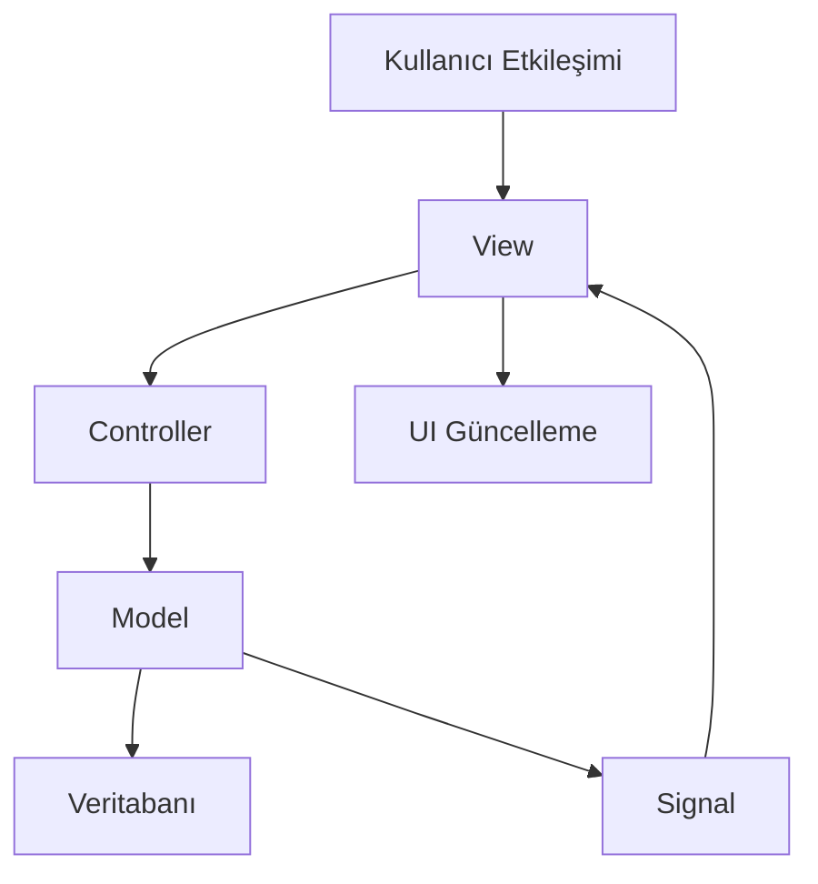

# 🎯 Ders Programı Oluşturucu - MVC Mimarisi

## 📁 Proje Yapısı

```
ders_programi/
├── models/                    # Model Katmanı
│   ├── __init__.py
│   └── schedule_model.py      # Veri işleme ve iş mantığı
├── views/                     # View Katmanı  
│   ├── __init__.py
│   └── schedule_view.py       # Kullanıcı arayüzü
├── controllers/               # Controller Katmanı
│   ├── __init__.py
│   └── schedule_controller.py # Model-View iletişimi
├── main.py                    # Ana uygulama giriş noktası
├── sql_to_py.py              # Veritabanı yöneticisi (DbManager) - DEPRECATED
└── README_MVC.md             # Bu dosya
```

## 🏗️ MVC Mimarisi Açıklaması

### **Model (models/schedule_model.py)**
- **Sorumluluk**: Veri işleme ve iş mantığı
- **Özellikler**:
  - SQLite veritabanı işlemleri
  - Ders ekleme/silme/güncelleme
  - Zaman çakışması kontrolü
  - Veri doğrulama
  - Signal'lar ile View'e bildirim

### **View (views/schedule_view.py)**
- **Sorumluluk**: Kullanıcı arayüzü
- **Özellikler**:
  - PyQt5 widget'ları
  - Kullanıcı etkileşimleri
  - Signal'lar ile Controller'a bildirim
  - Modern ve kullanıcı dostu tasarım

### **Controller (controllers/schedule_controller.py)**
- **Sorumluluk**: Model ve View arasında iletişim
- **Özellikler**:
  - Signal bağlantıları
  - İş akışı yönetimi
  - Veri koordinasyonu

## 🔄 MVC İş Akışı



### **Ders Ekleme Örneği**:
1. **View**: Kullanıcı "Dersi Ekle" butonuna tıklar
2. **Controller**: View'den gelen veriyi alır
3. **Model**: Veriyi doğrular ve veritabanına kaydeder
4. **Model**: Başarılı olursa signal gönderir
5. **View**: Signal'ı alır ve UI'yı günceller

## ✨ Yeni Özellikler

### **Geliştirilmiş UI**
- Modern buton tasarımları
- Renkli arayüz
- Daha iyi kullanıcı deneyimi
- Responsive tasarım

### **Gelişmiş Hata Yönetimi**
- Merkezi hata yönetimi
- Kullanıcı dostu hata mesajları
- Signal tabanlı bildirimler

### **Kod Organizasyonu**
- Temiz kod yapısı
- Ayrılmış sorumluluklar
- Genişletilebilir mimari
- Test edilebilir bileşenler

## 🚀 Kullanım

```bash
# Uygulamayı başlat
python main.py
```

## 🔧 Geliştirme

### **Yeni Özellik Ekleme**:
1. **Model**: Veri işleme mantığını ekle
2. **View**: UI bileşenlerini ekle
3. **Controller**: İletişim mantığını ekle

### **Örnek - Yeni Özellik**:
```python
# Model'de yeni method
def export_schedule(self, format_type):
    # Export logic here
    pass

# View'de yeni UI element
def create_export_button(self):
    self.export_btn = QPushButton("Export")
    self.export_btn.clicked.connect(self.export_requested.emit)

# Controller'da yeni handler
def handle_export(self, format_type):
    self.model.export_schedule(format_type)
```

## 📊 Avantajlar

✅ **Separation of Concerns**: Her katman kendi sorumluluğuna odaklanır
✅ **Maintainability**: Kod bakımı kolaylaşır
✅ **Testability**: Her katman ayrı test edilebilir
✅ **Scalability**: Yeni özellikler kolay eklenir
✅ **Reusability**: Bileşenler yeniden kullanılabilir

## 🔮 Gelecek Geliştirmeler

- [ ] Haftalık program tablosu görünümü
- [ ] PDF/Excel export
- [ ] Import/Export işlevleri
- [ ] Gelişmiş raporlama
- [ ] Web arayüzü
- [ ] API endpoints
- [ ] Unit testler
- [ ] Dokümantasyon

## 📝 Notlar

- `sql_to_py.py` dosyası `schedule_model.py` ile birleştirildi
- DbManager sınıfı artık ScheduleModel içinde entegre
- Geriye dönük uyumluluk sağlandı
- Signal-Slot mekanizması kullanıldı
- Modern Python typing kullanıldı
- Tek dosyada tüm veri işlemleri
